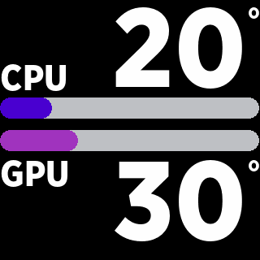

# TempBarsGen
Python-based Linux monitor for NZXT Kraken LCD displays. Recreates dynamic CPU and GPU temperature bars using static images updated in real time via liquidctl, simulating the original NZXT Windows animation on 320×320 LCD screens.

# NZXT Kraken LCD – Linux Dynamic Temperature Bars

This project is a **Python script** designed to be used with the **NZXT Kraken 2023** liquid cooler on **Linux**.

The script recreates, through rapidly updated static images, the **dynamic temperature bars animation** originally available on Windows via NZXT CAM, displaying **CPU and GPU temperatures** directly on the Kraken LCD.

---

## ✨ Features

- Compatible with **NZXT Kraken 2023**
- Recreates the original NZXT animated temperature bars
- Displays **CPU** and **GPU** temperatures in real time
- Image update every **0.5 seconds**
- Can run **in background at system startup**
- Configurable screen rotation and brightness
- Entirely based on static images sent to the LCD

> ⚠️ The script can also work with **any NZXT display** that supports **320×320 pixel images**.

---

## 🛠 Technologies Used

The project is based on **four main Python libraries**:

- `time` – timing and refresh control
- `subprocess` – execution of `liquidctl` commands
- `psutil` – CPU and GPU temperature readings
- `PIL (Pillow)` – image and graphics generation

External tool required:

- **`liquidctl`** – communication with NZXT hardware

---

## ⚙️ How It Works

1. The LCD resolution is defined as **320×320 pixels**
2. All bar and text positions are calculated
3. CPU and GPU temperatures are read using `psutil`
4. A new image is generated using **Pillow**
5. The image is sent to the Kraken LCD via `liquidctl`
6. The image is updated every **0.5 seconds**

The entire process runs in a **fraction of a second**, creating the illusion of a smooth animation.

---

## 🚀 Automatic Startup

The script can be executed automatically at **system startup** using a **systemd user service** (recommended).

At each startup:
- the screen is rotated by **270 degrees**
- the LCD brightness is set to **100%**

These values can be changed by editing the numeric parameters inside the following functions:

- `set_lcd_orientation()`
- `set_lcd_brightness()`

---

## 📦 Installation Guide

### 1️⃣ Requirements

To use this project you need:
- Linux operating system
- NZXT Kraken 2023 (or compatible NZXT 320×320 display)
- Python **3.9 or newer**
- `liquidctl` installed and working
- Access to hardware sensors (CPU and GPU)

---

### 2️⃣ Install Dependencies

Make sure `liquidctl` is installed and working:
- Verify with `liquidctl list`

Install required Python libraries:
- `psutil`
- `Pillow (PIL)`

Install them using pip:
- `pip install psutil pillow`

---

### 3️⃣ Script Placement

Download the Python script and place it in a directory of your choice, for example:

`/home/your_username/Documents/liquidctl_new_project/`

Inside this directory, create a subfolder named:

`img`

This folder will be used to store the generated image sent to the LCD.

---

### 4️⃣ Configure Paths

Open the `.py` file and update the output image path:

`OUTPUT_PNG = /home/your_username/Documents/liquidctl_new_project/img/logo.png`

Make sure the path is correct and that the `img` directory exists.

---

### 5️⃣ Font Installation (REQUIRED)

This project **requires** the following font:

`gothamnarrssm_black.otf`

Install the **GothamSSm** font on your system, for example in:

`/home/your_username/.local/share/fonts/GothamSSm/`

Then update the font path inside the `.py` file:

`FONT_PATH = /home/your_username/.local/share/fonts/GothamSSm/gothamnarrssm_black.otf`

⚠️ It is very important to use **this exact font**, as the layout, alignment, and proportions of the graphics depend on it.

---

### 6️⃣ Manual Test

Run the script manually (inside your Python environment):

`python3 img_generator.py`

If everything is configured correctly:
- the Kraken LCD will show animated bars
- CPU and GPU temperatures will update every 0.5 seconds

---

### 7️⃣ Automatic Startup (Recommended)

The script can be started automatically at system boot using a **systemd user service**.

Create the service file:

`~/.config/systemd/user/kraken-lcd.service`

Configure it to run the Python script at user startup.

After creating the service:
- reload systemd
- enable the service
- start the service

This ensures the Kraken LCD is initialized automatically at every boot.

---

### 8️⃣ LCD Configuration

At every script startup:
- the screen orientation is set to **270 degrees**
- the brightness is set to **100%**

To change these settings, edit the numeric values in:
- `set_lcd_orientation()`
- `set_lcd_brightness()`

---

## 🧠 Final Notes

- The script uses static images to simulate animation
- Fast refresh creates a smooth visual effect
- Designed to run silently in background
- Easily adaptable to other NZXT 320×320 displays

---

## 📜 License

This project is released for personal and educational use.  
Feel free to modify and adapt it to your needs.

⭐ If you find this project useful, a **GitHub star** is always appreciated!
